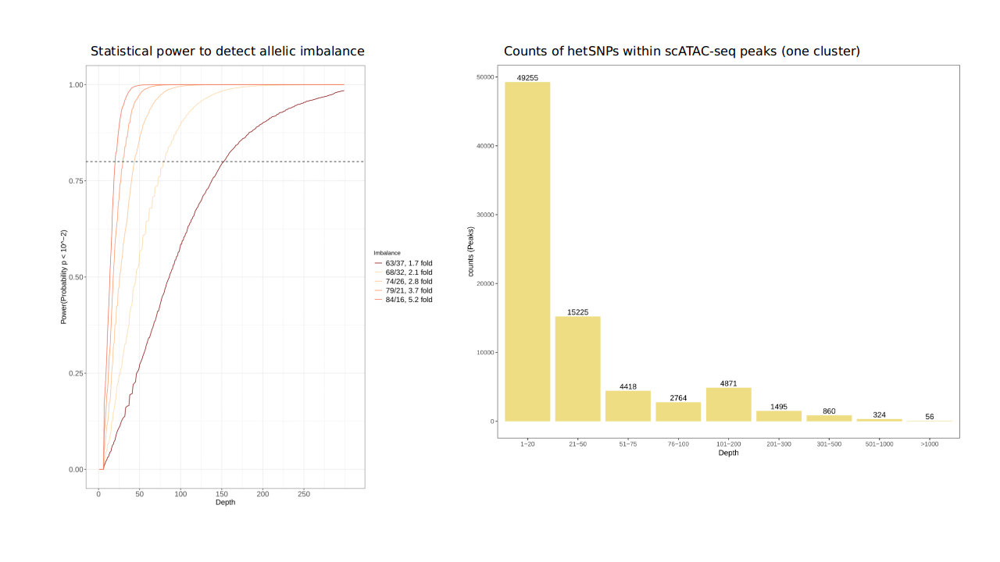

### Calculate coverage per SNP, power to detect allelic imbalance, and count heterozygous SNPs within genomic elements

Scripts to calculate the coverage per SNP in bam files. This repository was initially thought to explore single cell RNA and ATAC seq data, where we wanted to explore the obtained coverge per each cluster of cell. It is a complement to the SplitBam repository, which is of use for splitting a bam file from single cell data based on clusters of cells.

 CoveragePerSNP contains:

    • Script to calculate the coverage per SNP using samtools and bam-readcounts .

    • Script for calculating the power to detect allelic imbalance.

    • Script to count and plot the counts per features per SNPs found in
    heterozygous state (hetSNPs) that are located in specific genomic elements
    (e.g. Genes, Peaks, other genome coordinates)

    • Script to split bam files by chunks.

    • yml file to recreate the CovSnp conda environmnet.

This code allows the users to explore:
- How much coverage our sequencing experiment has to have to be able to detect allelic imbalance with
default effect values of 0.63,0.68,0.74,0.79,0.84? Effect values can be user adjusted.

- How many hetSNPs, using user defined depth and base quality, are located within genes, peaks, or other genome coordinates?
Additional parameters could be set by following bam-readcount manual available here: https://github.com/genome/bam-readcount.

#### Notes:
The code  was implemented to be used in high performance computing (HPC) facilities with queuing systems; therefore, it includes
submission scripts to the HPC.

The CoveragePerSnpParallel.pl script will read within the folder and search for all files bam files (*.bam)

Check the line "use Proc::Queue size=>31, qw(run_back);" to define the number of cores to be used.

It will split the bam file based on a particular length. The user can modify this length by changing the size in the script splitbamByshuncks.     

### Step I. Calculate the coverage per SNP (runs in parallel).

1. Create the environment using the coverage.yml file: conda env create -f coverage.yml. It will create a conda environment called CovSnp (Recommended step). The user can also install the required programs on its local file system using the listed programs in the yml file as guide.

2. Install the Proc::Queue perl module within the CovSnp environment using `cpanm Proc::Queue`.
This is of use running it in parallel.

3. Use the following information as input
  - filtering script
  - path to reference genome *.fa, *.fasta
  - file from vcf containing the chr, pos1 pos1
  - Minimun mapping quality to filter. Integer (e.g. 20)
  - Minimun  base quality. Integer (e.g. 20)
  - Maximum counts to be considered  
  Example:  `perl CoveragePerSnpParallel.pl reference.fa VCF_positions 20 20 600`

### Step II. Calculate the power and feature counts
In this step the statistical power for detecting allele imbalance is performed.

The script will read all *.cov.bed files, which are generated in the previous step, and calculate the power using as effect's values: 0.63,0.68,0.74,0.79,0.84. This values can be changed by within the script PowerAndFeatureCounts.pl.

Plot the statistical power per each sample will be created.

Counts the hextSNPs within specific genome elements (Genes or Peaks) will be calculated. For genes it will produce two feature files (txt) containing the information for exons and for genes. It will also plot the amount of HetSNPs per feature at different ranges of coverage.

To run this step you require the following information:
  - Power calculation script  (`PlottingPowerSim.R`)
  - *.cov.bed (for all files)
  - R script for plotting features, either for scRNA/scATAC.
  - vcf file, which will be subsequently parsed as chr, pos1 pos1
  - A GTF or simpler annotation format (SAF) file for counting the the HetSNPs for specific features (see data folder for examples)
    • The SAF annotation file format is: ID 	chr 	start 	end 	strand
    • For peak SAF annotation files set strand to +
  - Quality (Q) is set to 20, change as necessary: line running featureCounts
  - Multi-mapping reads (M) is active.
  - Multiple feature is activated (O) is active
  - Multiple processing is activated to 30 cores (-T)
  - Paired end reads is active (-p)
  - Fractional counts is active (-f)
  - Ignore duplicates is active (--ignoreDup)

#### Note:
Using a SAF file for getting information for exons will require to run it only with an annotation file for such features.

To run this step, use the following information as input:
  - Script `PowerAndFeatureCounts.pl`
  - Script `PlottingPowerSim.R`
  - Script `CountsFeaturesscRNA.R` or `CountsFeaturesscATAC.R`
  - AnnotationFile: Either GTF or SAF file
  - dataType: either rna/atac
  - AnnoType: either SAF or GTF
  Example: `perl PowerAndFeatureCounts.pl PlottingPowerSim.R CountsFeaturesscRNA.R annotation.gtf dataType=rna AnnoType=GTF`

### Count for features in hestSNPs with coverage higher than X
In the case that users want to calculate the counts for features where the hetSNPs have a coverage higher than X, and that are located in genes or peaks, the *cov files can be filtered using the three steps described below.

#### Notes:
Replace the number 20 in all lines to set the desired depth of coverage to filter hetSNP, and generate the customized GTF and SAF.

There must be a GTF file within the folder that contains the *.cov files

If you are going to run using only SAF files generated from a GTF (genes), use the the last line of the point 3 (#) and skip the line 4.  

If you are going to run using only a SAF file generated from a GTF (peaks), use the first two lines of the point 3.

1. source activate CovSnp

2. Filter of those hetSNPs that have a coverage higher than X (20 in the example) and create a *.bed file by using:
`for B in *dir.cov; do awk '{OFS="\t"; if($4>=20){print $0}}' $B | awk '{OFS="\t"; print $1,$2,$2,$4}' > ${B/.cov/20.bed}; done`

3. Generate a file to perform the overlap between hetSNPs (*.cov) and the GTF or SAF files

  - From gene annotation (GTF) to bed
  `for B in *.gtf; do awk '{OFS="\t"; print $1,$4,$5,$10}' $B | sed 's/"//g;' |sed 's/;//g;' > ${B/.gtf/.gtf.bed}; done`

  - From gene annotation (GTF) to SAF
  `for B in *.gtf; do grep -P '\ttranscript\t' $B| awk '{OFS="\t"; print $1,$4,$5,$10,$7}' | sed 's/"//g;' |sed 's/;//g;' > ${B/.gtf/.saf}; done`

  - from GTF peaks file to SAF use
  `for B in *.gtf; do awk '{OFS="\t"; print $1,$4,$5,$10,$7}' $B | sed 's/"//g;' |sed 's/;//g;' > ${B/.gtf/.saf}; done`

4. Put all the SNPs detected with coverage higher than X together, sort, and unique them. This will be used to generate a new filtered file

  - GTF and SAF file for  regions that contain hetSNP with depth > X and that are located within either Genes (GTF) or peaks (SAF)
  `cat *20.bed | sort -k1,1V -k2,2n -k3,3n | uniq > AllSNPs20.bed`

  - Generate the new  GFT and SAF with the annotation filtered based on the coverage of the hetSNPs. Here, regions that contain hetSNP with depth equal or higher than X and that are located within either Genes (GTF) or peaks (SAF) will be stored from in a subset file

    • From a Gene Annotation (GTF.bed) to subset.gtf
    `for B in *.gtf.bed; do  bedtools intersect -wao -a $B -b AllSNPs20.bed |  grep -v -P '\-1' |awk '{OFS="\t"; print $4}'| uniq |grep -f - ${B/.bed/} > ${B/.gtf.bed/.subset20.gtf}; done`

  	• From a GTF peaks file to SAF to subset.saf
    `for B in *.saf; do  bedtools intersect -wao -a $B -b AllSNPs20.bed|  grep -v -P '\-1' |awk '{OFS="\t"; print $4}'| uniq |grep -f - $B > ${B/.saf/.subset20.saf}; done`

5. delete intermediate *.bed files
  `rm *dir20.bed`
